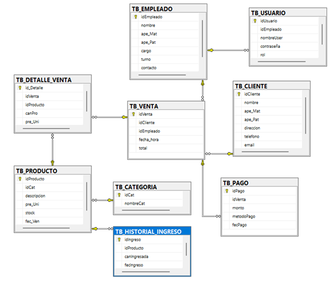

# Modelo de Base de Datos - Tienda de Conveniencia

Este proyecto consiste en el diseño y creación de una base de datos relacional para automatizar los procesos de ventas, inventario y gestión de personal.

##  Tecnologías Utilizadas
* **Motor:** Microsoft SQL Server
* **Modelado:** Modelio / RSA (UML)
* **Metodología:** IEEE 830 para requerimientos.

##  Diseño del Modelo
A continuación se presenta el modelo relacional diseñado para el sistema:

##  Funcionalidades Clave
* **Normalización:** Estructura optimizada hasta la 3ra Forma Normal (3FN).
* **Consultas Avanzadas:** Reportes de ventas por periodo y gestión de stock.
* **Seguridad:** Configuración de roles y auditoría de base de datos.

##  Estructura del Proyecto
* `/database_scripts.sql`: Scripts de creación de tablas y procedimientos.
* `/documentacion`: (Opcional) Puedes subir el PDF del informe aquí.
